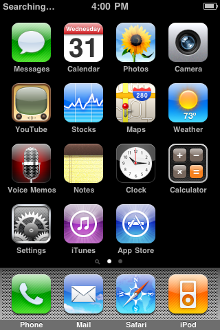

<div align="center">

# S5LBox

### A from-scratch S5L8900 emulator that boots real iPhone OS 3.1.3 inside an iOS app

[](https://github.com/j0shua-SYSON/S5LBox/actions/workflows/core-tests.yml)
[](https://github.com/j0shua-SYSON/S5LBox/actions/workflows/ios-build.yml)
[](LICENSE)


**Stock iPhones are supported. The host does not need to be jailbroken.**

</div>

S5LBox emulates the original iPhone's Samsung S5L8900 SoC and ARMv6 CPU,
then runs Apple's actual iPhone OS 3.1.3 kernel, drivers, services, SpringBoard,
and applications on that hardware model. It is not a themed UI or an
operating-system reimplementation.

You must supply firmware you are entitled to use. This repository contains no
Apple firmware image or decryption key, and the app does not download either.
The supplied files remain unchanged; S5LBox patches loaded copies and writes to
a separate per-machine disk image.

> [!IMPORTANT]
> This is a working emulator under active development, not a finished
> compatibility product. Boot, touch, applications, checkpoint/resume,
> guest networking, and a narrow Cydia package transaction have been
> demonstrated on physical iPhones. Stable 30 fps, general long-session
> reliability, sound output, broad package/tweak compatibility, and direct IPA
> installation have not.

<p align="center">
  
  &nbsp;&nbsp;
  
</p>

<p align="center"><em>Both frames were composited by Apple's guest software and scanned out through the emulated display controller.</em></p>

## Current status

The table below is the short version as of 2026-08-13. The detailed evidence,
controls, failures, and retractions are preserved in
[Quality and validation](docs/QUALITY.md) and the
[boot log](docs/BOOTLOG.md).

| Area | Current result | Honest limit |
|---|---|---|
| **Boot and UI** | The real XNU 1357.5.30 kernel boots, mounts the real root filesystem, starts Apple's services and SpringBoard, and reaches the lock and home screens. Built-in apps launch and can be navigated. | S5LBox jumps directly to XNU. It does not execute the SecureROM, low-level bootloader, and iBoot as one secure boot chain. |
| **Touch and buttons** | One-finger touch travels through the emulated Z2 digitizer, Apple's driver, HID, UIKit, and SpringBoard. Slide-to-unlock and ordinary taps work. Physical Home, Power, volume, and silent controls are exposed by the app. | Multiple simultaneous contacts reach userspace, but a useful two-finger gesture has not been demonstrated. |
| **iOS host** | The app is an arm64, iOS 13+ application with an empty entitlement file. It runs the guest on stock iPhones without runtime-generated code. | Physical coverage is still only a few devices and OS versions, not a compatibility matrix. |
| **Machines and resume** | The app stores multiple independent machines. Leaving a running machine with Back shows a saving screen and atomically writes one automatic resume point; reopening consumes it and restores the exact running state. | Only one automatic latest-session checkpoint is supported. Named Take/Open snapshots are intentionally unavailable until their disk-history lifecycle is safe. |
| **Powered-off guest** | If iPhone OS shuts down completely, reopening detects the quiesced checkpoint, preserves its clean disk, discards the unusable stopped CPU state, and performs a cold guest boot. | This recovery path was physically verified for one shutdown, cold boot, save, and resume cycle. It is not broad soak coverage, and the UI does not yet have a distinct persistent powered-off state. |
| **Internet** | The app terminates the guest's stock `pppd` over emulated uart4, assigns `10.0.2.15`, and routes guest IPv4 TCP/UDP, DNS, and ICMP through ordinary host networking APIs. A physical guest downloaded and installed a package from Cydia's official archive. | This is a PPP/NAT compatibility transport, not emulated Wi-Fi or cellular hardware. The guest can still show **No Service**. iPhone OS 3's obsolete browser and TLS stack remain incompatible with many modern sites. |
| **Guest jailbreak** | A normal Settings action downloads an exact pinned iPhone OS 3-era bootstrap and Cydia package set, verifies every artifact, builds a replacement guest disk transactionally, disables guest signature enforcement, and grows new jailbreak disks to 2 GiB. | It modifies only the emulated guest, never the host. One `adv-cmds` install was physically verified; general packages, upgrades, MobileSubstrate, and tweak support are not established. No package payload is bundled in the app. |
| **Graphics** | Apple's CPU software renderer is the compatible default. The experimental MBX model now handles the measured reset, ring, 2D, and 3D command families and can be visibly much smoother. Recent bounded physical replays covered boot, unlock, apps, sleep/wake, and checkpoint/restore without an MBX decoder rejection. | MBX is still opt-in. Its model is based on observed command streams, not a complete PowerVR specification, and it has not passed a long-session acceptance soak. |
| **Performance and timing** | The iOS build includes a bounded build-time-generated arm64 execution engine with exact interpreter fallback. Recent fixes removed known terminal CPU-status failures and add guards against pathological input work overtaking guest deadlines. | There is no sustained 30 fps claim. Complex transitions can still slow down, and the newest timing work is test-covered but not yet enough to close long-session stall reports. Guest Minsn/s is not the same measurement as visible FPS. |
| **Audio** | WM8991, both I2S controllers, and PL080 DMA are modelled and unit-tested; Apple's audio driver starts. | The iOS app has no host playback path, and audible output has never been verified. |
| **Install IPA** | Not implemented. | The guest jailbreak is not a substitute for a safe, user-facing IPA installer. |

## What S5LBox emulates

- An ARMv6 CPU interpreter with ARM, Thumb, VFPv2, MMU, exception, and
  no-execute behavior over the paths reached by iPhone OS 3.
- S5L8900 interrupt controllers, timers, GPIO, UART, SPI, display, power
  management, I2C, multitouch, USB configuration registers, audio devices,
  DMA, and an experimental MBX graphics path.
- A block device backed by a per-machine writable host file.
- A host-neutral PPP, IPv4, DNS, ICMP, TCP, UDP, and NAT core, with an
  iOS socket adapter.

Some devices are hidden from the default guest because a silent, incomplete
device is worse than an absent one. Cellular/baseband, Wi-Fi, Bluetooth,
camera, accelerometer, SHA-1 acceleration, and USB data transport are not
usable. The accepted default also hides MBX and selects Apple's CPU compositor;
MBX can be enabled deliberately for a newly prepared machine.

The loaded kernel and device tree receive tightly gated compatibility changes:
the root device is redirected to the emulated disk, the missing iBoot-provided
memory/panel/video-memory properties are supplied, known incomplete devices are
removed, and exact storage and timing hooks are installed. Input size, hashes,
and kernel layout are checked before the firmware-specific patch set is used.
The original firmware files are never rewritten.

New work images are provisioned as offline `FactoryActivated` by default. No
activation record is obtained from Apple or cryptographically verified. The
guest RTC calendar is also still a placeholder, so its displayed date and time
can be wrong even while monotonic guest timing is working correctly.

See [Architecture](docs/ARCHITECTURE.md) and
[Derivations cited by the source](docs/derivations.md) for the implementation
and evidence boundaries.

## Using the iOS app

### 1. Build or obtain the app

The [ios-build workflow](https://github.com/j0shua-SYSON/S5LBox/actions/workflows/ios-build.yml)
produces an ad-hoc-signed `S5LBox.ipa` artifact. CI has no Apple development
identity, so that artifact is a transport package, not something a stock iPhone
can install unchanged. Re-sign it with your own valid provisioning profile and
install it through your normal stock-device method.

The shipping target requests no JIT, debug, private, increased-memory, or
host-jailbreak entitlement. The dynamic recompiler remains a separately tested
research path and is excluded from the iOS application. The arm64 fast path
used by the app is generated at build time, signed with the rest of the binary,
and never makes writable memory executable.

### 2. Import firmware

Open Settings from the Machines screen and select **Import from an IPSW**.
Choose your own iPhone OS 3.1.3 IPSW and provide only the keys that are absent
from that archive. The importer extracts and validates the exact kernel,
device tree, and root filesystem needed by the current boot path.

Nothing is downloaded on your behalf, and no key list is embedded. The
desktop firmware procedure is documented in
[Boot-chain notes](docs/BOOT_CHAIN.md).

### 3. Choose image-time options before first boot

Two important choices are written into a machine's work image when it is first
prepared. Changing them later does not convert that existing image.

- **Graphics for new machines:** **CPU software** is the compatible default.
  **Experimental MBX** enables the GPU model and disables the CPU-renderer
  override as one paired choice.
- **Internet:** turn on **Developer Mode**, enable **Guest networking (PPP over
  uart4)**, and leave **Route guest traffic to the internet** enabled before
  preparing the machine. PPP is off by default; NAT is on but inert without
  PPP. Once enabled, traffic follows the host iPhone's active IPv4 connection;
  there is no separate guest Wi-Fi network to select.

Create a machine and open it. The first start prepares its writable image and
cold-boots the guest. Later starts normally restore the automatic checkpoint.

### 4. Save and resume

Use the app's Back button while the guest is running. S5LBox displays a saving
screen, publishes the checkpoint and disk sidecar atomically, and returns to
Machines only after the one-shot resume request is durable. Opening the machine
again restores that point.

A full guest shutdown is different from suspend: its CPU state cannot continue.
S5LBox recognizes that state and cold-boots from the clean guest disk instead.

### 5. Install the guest jailbreak

The **Jailbreak...** action is in normal Settings, not Developer Mode. Close the
target machine first, select the action, read the disclaimer, and choose the
machine to modify. A progress screen remains visible while the exact pinned
packages are downloaded, verified, assembled, and transactionally published.

The result is an iPhone OS 3-era bootstrap with Cydia 1.0.3044-66 inside the
guest. Fresh installs receive a 2 GiB HFSX disk and the official Cydia source.
A narrowly recognized older installation can be copied, grown, and have one
known Cydia executable-permission defect repaired; unexpected content or
metadata fails closed. An older guest that needs migration must first complete
its own shutdown so its filesystem is cleanly unmounted.

Do not treat the five essential upgrades Cydia may offer as tested. The
bootstrap is version-pinned for iPhone OS 3 compatibility, and a blanket
upgrade has not been validated.

## Performance: the honest version

S5LBox is usable, but it is not finished.

- **CPU software rendering** is conservative and compatible, but expensive.
  Full-screen transitions, keyboards, and application navigation can be far
  slower than a static or lightly animated screen.
- **Experimental MBX** removes much of that guest-side software composition
  and has shown substantially better visual cadence. It is the promising
  route, but a short successful replay is not proof of hours-long stability.
- **Peak FPS is not the acceptance test.** Consistent navigation, keyboard
  input, sleep/wake, app transitions, and checkpoint/restore matter more than
  an icon-jiggle peak. No build has yet earned a sustained 30 fps claim.
- **Instruction throughput is not frame rate.** Past runs with much higher
  Minsn/s still displayed poorly because guest work, frame production, scanout,
  and host presentation are separate bottlenecks.
- **Stock-device support is non-negotiable.** Performance work cannot depend on
  a runtime JIT or privileged host environment.

The current profiling and rejected experiments are recorded in
[Where the time goes](docs/hotpath.md). Results are kept even when an
optimization saves work but does not improve visible FPS; useful efficiency is
not discarded, and regressions are not shipped merely because an idea sounded
promising.

## Build and test the portable core

S5LBox's core is C11 with no required third-party runtime dependency. On any
host with CMake and a C compiler:

```sh
cmake -S . -B build -DCMAKE_BUILD_TYPE=Release
cmake --build build --config Release
ctest --test-dir build -C Release --output-on-failure
```

Use a separate build directory with `-DS5LBOX_JIT=ON` to compile and test the
dynamic recompiler. It is not used by the iOS app.

GitHub Actions builds and tests the core on Linux, macOS, and Windows, including
strict warnings, sanitizers, JIT execution on Apple Silicon, and the
build-time-signed arm64 engine. CI also compiles, links, signs, and packages the
iOS app. A green iOS build proves buildability; it does not prove behavior on a
physical phone.

## Desktop firmware boot

The diagnostic desktop harness keeps the richest traces and failure controls.
With firmware you supplied and a work-image path that does not already exist:

```sh
mkdir -p work
build/core/bootkernel firmware/kernel.macho \
    -d firmware/devicetree.bin \
    -c "debug=0x8 serial=1 nand-enable-adm=0" \
    --external-md firmware/rootfs.img work/rootfs-7e18-run01.img \
    -R 128 \
    -n 420000000
```

`--external-md` accepts only the currently supported iPhone OS 3.1.3 (7E18)
inputs:

| Input | Bytes | SHA-256 |
|---|---:|---|
| `kernel.macho` | 7,942,144 | `0d8cdb339d37cf37a1db2638fff79272ecd63a17764bf7666efa1618725df70c` |
| `devicetree.bin` | 40,544 | `4867c95fedf544bda2ecaa2626ae14c01a60d7771dc53ffe6fd3a6aac8b8ba57` |
| `rootfs.img` | 433,274,880 | `c3251e7f092c939d5818e92086cb47680981cfb03731de7b55d238c942eb5e82` |

The default writable work image is 466,825,216 bytes (about 445 MiB). The
source image stays read-only. Work images, logs, checkpoints, and any cleanup
temporaries can be large, so keep adequate free space.

Useful tools include:

| Tool | Purpose |
|---|---|
| `bootkernel` | Boot, trace, profile, snapshot, restore, and report the exact terminal state. |
| `snapboot` | Validate snapshot round trips against live machine state. |
| `machoinfo` | Inspect the kernel driver map and resolve addresses. |
| `img3dump`, `unlzss`, `runfw` | Inspect containers, decompress payloads, and run bare firmware payloads. |

See [Debugging](docs/debugging.md) for the evidence-driven workflow.

## Documentation

| Document | Start here for |
|---|---|
| [Quality and validation](docs/QUALITY.md) | What was actually tested, on which path, and what each result does not prove |
| [Roadmap](docs/ROADMAP.md) | Priorities and remaining product work |
| [Architecture](docs/ARCHITECTURE.md) | Components, ownership, and runtime flow |
| [Boot log](docs/BOOTLOG.md) | Chronological bring-up history, including failed hypotheses |
| [Performance notes](docs/hotpath.md) | CPU, frame, timing, and MBX measurements |
| [Networking](docs/networking.md) | PPP/NAT design and protocol evidence |
| [Multitouch](docs/multitouch.md) | Z2 bootload and input-path investigation |
| [Debugging](docs/debugging.md) | Reproduction and diagnosis procedure |

Several documents are deliberately lab notebooks. They preserve dead ends and
older conclusions instead of rewriting history; later dated entries and explicit
retractions supersede earlier ones.

## Requirements

- A modern arm64 iPhone running iOS 13 or later.
- Your own valid app provisioning/signing method.
- Your own iPhone OS 3.1.3 firmware and any required keys.
- Enough free storage for the app, imported firmware, and at least one writable
  machine image. A jailbroken guest uses a 2 GiB disk image.

The app has been observed booting the guest on a stock iPhone17,2 running iOS
26.1 and on an iPhone8,2 running iOS 15.8.5. Those are two data points, not a
promise that every iOS 13+ device and release behaves identically.

## Legal

S5LBox is independently written and released under the
[MIT License](LICENSE). It ships no Apple firmware image or decryption key.
You are responsible for supplying firmware you are entitled to use and for
complying with the licenses and terms of any optional guest packages you choose
to download.

"Apple", "iPhone", "iOS", and "iPhone OS" are trademarks of Apple Inc. This
project is not affiliated with or endorsed by Apple.

## Credits

Created by [j0shua-SYSON](https://github.com/j0shua-SYSON), with thanks to the
reverse-engineering community whose public research made the S5L8900 boot chain
and early iPhone firmware formats understandable.
