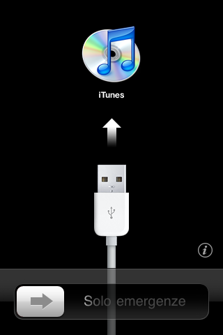

<div align="center">

# iOS3-VM

### Project goal: boot **real iPhone OS 3** — Apple's actual kernel, `launchd`, and SpringBoard — inside an app on a modern, jailbroken iPhone.

*A from-scratch emulator of the 2007 iPhone's chip, written in portable C.*

[](https://github.com/j0shua-SYSON/iOS3-VM/actions/workflows/core-tests.yml)
[](https://github.com/j0shua-SYSON/iOS3-VM/actions/workflows/ios-build.yml)
[](LICENSE)


</div>

---

iOS3-VM does not reimplement iPhone OS or fake its apps. It emulates the
**hardware** of the original iPhone — the Samsung **S5L8900** chip and its ARMv6
processor — in software, then runs Apple's own unmodified operating system on
top of that model. You supply the firmware; none is included here. To the
maintainers' knowledge no publicly documented open-source emulator has booted
iPhone OS 3.x to a home screen (the nearest prior art reaches 1.1 and 2.1.1 on
emulated iPod touch hardware) — positioning, not proof that no private
implementation exists.

## What this is, and what it is not

Read this before anything else on this page.

**What is real:** your own unmodified iPhone OS 3.1.3 (7E18) firmware executes.
Apple's real kernel (XNU 1357.5.30) boots, Apple's own drivers start, the real
root filesystem mounts, and the real background programs run: `launchd`,
`securityd`, `installd`, `mDNSResponder`, `fairplayd`, `itunesstored`,
`lockbot`, `CommCenter`, SpringBoard. The clearest evidence that this is
genuinely Apple's stack and not a reimplementation of it: when SpringBoard
crashed, the guest's **own** crash reporter wrote real crash reports into its
own filesystem, and that is how the current blocker was diagnosed. The project
ships no Apple firmware and never modifies the files you supply.

**What is not real:** the single most visible property of an iPhone — that it
displays a home screen **you can touch** — is still not demonstrated here. As of
run59 the guest does draw real frames: SpringBoard composites through Apple's own
software renderer and the pixels reach the emulated panel. But what it draws is
the activation screen or the boot spinner, never a home screen. Activation is
now provisioned and it did not produce one: SpringBoard launches, opens the
touchscreen's IOKit user client, and blocks in the fourth method it calls
(run66, 12 billion instructions, zero CoreAnimation transaction flushes, the
framebuffer unchanged for the final 10.1 billion).

Touch reaches the driver but nothing above it. run77 shows the emulated
controller delivering four reports that Apple's own `AppleMultitouchZ2SPI`
reads and whose checksums it accepts — but no userspace client had subscribed,
so nothing was delivered to an application, and **no tap has ever reached
SpringBoard**. There is no audio and no graphics chip. Five pieces of hardware
a real iPhone has are deliberately hidden from the guest, so it is told it is
running on a machine with less hardware than a real iPhone.

<div align="center">



*run59, instruction 4.97e9 — the first frame. Drawn by the guest's own
SpringBoard through Apple's CPU compositor, scanned out through the emulated
display controller. Nothing here is drawn by the host.*

</div>

| | |
|---|---|
| **Real Apple software** | Your own unmodified 3.1.3 (7E18) firmware: the XNU 1357.5.30 kernel, Apple's own drivers, the real root filesystem, and the real background programs listed above. No Apple firmware is shipped, and the files you supply are never modified on disk. |
| **CPU** | ARM, Thumb and VFPv2 floating point — over the code the boot has actually reached, not the whole architecture. The ARMv6 rules for unaligned memory access are honoured, memory translation enforces no-execute pages, and the system-control coprocessor is modelled. Runs are bit-exact reproducible. |
| **Hardware modelled** | Serial ports, timers, both interrupt controllers, the GPIO controller, display controller, SPI, the multitouch controller, the power-management chip and its I2C bus, and the USB controller's configuration registers. |
| **Touch: the device works, the path does not** | The Z2 touchscreen is modelled on SPI, and Apple's own `AppleMultitouchZ2SPI` drives it: run77 delivered four reports that the driver read and whose payload checksums it accepted (probe `0xc04413e8`, reachable only through the branch taken after `cmp r5,r0`). That proves the wire format and one direction of one bus. It does **not** mean touch works — no userspace client had subscribed, so no frame was handed to an application, and no tap has ever reached SpringBoard. |
| **Not modelled at all** | No audio. No cellular. No Wi-Fi. No Bluetooth. No camera. No accelerometer. No GPU. |
| **Networking: a temporary substitution** | The guest's own stock `pppd` runs on an emulated second serial port and, as of run80, transmits a complete LCP Configure-Request — `7E FF 7D 23 C0 21 …`, 47 bytes, RFC 1662 framing, RFC 1661 options. **Nothing answers it.** There is no host-side PPP endpoint, no address is negotiated, and no packet has been carried; what is proven is one direction of one link layer. It is honest emulation — real modelled silicon, Apple's own binary, and a protocol fully specified in public RFCs — but **a real iPhone 3G never connected this way**; it used Wi-Fi over SDIO or the cellular baseband. The guest gets a `ppp0` interface rather than real wireless. This is a deliberate workaround chosen because the Wi-Fi part runs undocumented firmware that would have to be *invented* to emulate, and inventing behaviour is not something this project does. Modelling the real radio and controllers remains the goal. |
| **Hidden from the guest** | Five pieces of hardware a real iPhone has are deliberately declared absent, by editing the in-memory copy of the device tree — the hardware inventory the emulator hands the kernel at boot — so Apple's drivers for them never start: the PowerVR MBX graphics chip, the SHA-1 hashing accelerator, the cellular baseband, the serial link to that baseband, and the USB controller. The firmware on disk is never modified; only the loaded copy is edited. Each omission has a documented reason, but the net effect is that the guest is told it is running on a machine with less hardware than a real iPhone. |
| **Invented register values** | The USB controller's three configuration registers (`GHWCFG1`/`GHWCFG2`/`GHWCFG4`) hold a legal and sufficient configuration. They are **not** measured from real S5L8900 silicon. |
| **Rendering** | QuartzCore, Apple's own graphics layer, is set to `CA_ENABLE_MBX2D=0` so it uses the CPU software renderer Apple built into it. The real device draws on the MBX graphics chip. This is a switch Apple's code reads and a renderer Apple shipped, but it is not the path real hardware takes. |
| **Speed** | Not cycle-accurate. An interpreter running roughly **200x slower** than the real 412 MHz part, with an invented 412 MHz : 6 MHz ratio between instructions and the guest's clock rather than real cycle timing. |
| **Kernel patches** | The kernel is modified in memory as it loads: a real-time-clock timeout is forced to zero, the root-device lookup is redirected to the emulator's fake disk, and hooks are installed so the guest's disk access reaches the host. Applied only after checking a SHA-256 hash and a nine-segment layout check of the exact 7,942,144-byte kernel. |
| **Storage** | Not flash memory. The root filesystem is served from a file on the host into a fresh writable copy made for each run, and the guest's `/etc/fstab` is rewritten inside that copy to match. |
| **Boot chain** | No secure boot chain is executed. The kernel is loaded directly; the boot ROM, the low-level bootloader and iBoot are not run. Apple's firmware container format has been parsed and an extracted bootloader payload executed, but separately, never as a chain. |
| **Optional substitution** | Off by default: one of the guest's service-configuration files is rewritten in the work copy, without changing its size, to add `CA_ENABLE_MBX2D=0`. |
| **Rendering reached, use not** | run59 draws real frames — 14,264,987 changed scanout bytes, 97,510 of 460,800 framebuffer bytes non-zero, against 384 (the pre-guest seed) in every earlier run. What is on screen is the **activation** UI, because that run's guest is unactivated. |
| **Activation does not produce a home screen** | Provisioning `ActivationState = FactoryActivated` clears the lockout — the iTunes-connect artwork is gone — and what replaces it is the boot spinner, not a home screen. run66 ran 12 billion instructions with it: `CATransaction-flush` was called **0** times, the last scanout write was at instruction 1,887,035,649, and the final frame held 1,833 of 460,800 non-zero bytes. SpringBoard opens the touchscreen's IOKit user client and blocks in the fourth method it calls. Why is under measurement; it is not yet known. |

> The evidence behind every claim above — what was measured, in which run, and
> what each result does *not* prove — is in
> [Quality and validation](docs/QUALITY.md). An AI agent continuing the project
> should begin with the [continuation handoff](docs/AGENT_HANDOFF.md).

## Current status

Milestones 0 through 4 are done: the build and test pipeline runs in CI; the
emulated chip runs bare-metal code and prints over its serial port; Apple's
firmware containers parse and a real bootloader payload executes; and the real
XNU kernel boots, starts Apple's own drivers, and mounts the real 413 MiB root
filesystem. Here is that kernel introducing itself over the emulated serial
port, on hardware that exists only as C in this repository:

```
Seatbelt MACF policy initialized
BSD root: md0, major 2, minor 0
AppleS5L8900XIO::start: chip-revision: EVT0
AppleARMPL192VIC::start: _vicBaseAddress = 0xe3141000
AppleS5L8900XSerial: Identified Serial Port on ARM Device=uart0 at 0x3cc00000
AppleMultitouchZ2SPI: successfully started
IOSDIOController::enumerateSlot(): CMD5 failed ... (no card is modelled)
```

Those lines come from **Apple's own kernel extensions**, unmodified, after they
matched the emulated hardware — evidence the guest reached those drivers, not
that every device behind them is complete.

Milestone 5 — `launchd` starts SpringBoard, the home screen renders, and you tap
it — is **in progress and not reached.**

The first blocker is fixed. SpringBoard used to die and be restarted roughly
every 470 million instructions — 30 times in a single run — because Apple's
rendering code had been told to use the MBX graphics chip this emulator
deliberately does not provide, and then stored through a null pointer. Setting
`CA_ENABLE_MBX2D=0` in SpringBoard's environment ended that loop: it is a switch
Apple's own code reads, selecting the CPU renderer Apple already ships, so it
needs no GPU emulation. Thirty restarts became one, and SpringBoard went on to
build its interface and make its window visible for the first time.

The second blocker is fixed too, and the guest now renders. SpringBoard used to
die writing the screen, with a memory-protection fault on the very first store.
The cause was four indirections away: `/device-tree/vram` ships with
`reg = {0,0}` and real iBoot fills it in. We load the kernel directly, never run
iBoot, and so never did. Without it Apple's IOSurface layer cannot publish its
video-memory region, the display driver falls back to describing the framebuffer
as output-only, and the kernel then maps output-only memory **read-only** into
the process that wanted to draw on it. Apple's code was correct throughout; we
had simply never told it where video memory lives.

Filling that one property in — the same in-memory device-tree patch this
emulator already applies for the DRAM bank and the panel ID — produced the frame
above: **14,264,987 changed scanout bytes**, where every previous run changed
zero. SpringBoard was still compositing when the run hit its cap.

That run's device is **unactivated**, so what SpringBoard draws is the
activation screen. Activating it does not produce a home screen either:
`ActivationState = FactoryActivated` is provisioned into the work image and
clears the lockout, and what appears instead is the boot spinner. SpringBoard
opens the touchscreen's IOKit user client and blocks in the fourth method it
calls, having flushed no CoreAnimation transaction at all. That block is
located but not yet explained.

Milestones are tracked in [`docs/ROADMAP.md`](docs/ROADMAP.md), the run-by-run
history including every dead end in [`docs/BOOTLOG.md`](docs/BOOTLOG.md), and
the diagnosis procedure in [`docs/debugging.md`](docs/debugging.md).

**Two separate things exist.** The command-line harness (`bootkernel`) runs
Apple's real software, on a desktop. The installable iPhone app runs only a
small synthetic test program exercising the CPU, serial port and screen bridge —
it cannot boot the OS yet, and has no audio or networking. A finger on its
screen is now mapped to panel pixels and handed to the emulated touch
controller, but that controller refuses reports while no driver has announced
itself, and the app's synthetic guest has none; the app says so on screen
rather than reporting a delivery that did not happen. Merging the two into a
shared guest session is the next app-side prerequisite.

## How it works

The emulator models the chip, not the operating system: an ARMv6 CPU
interpreter, memory translation, and device models for the serial port, timers,
interrupts, display controller and power management, with the guest's disk
served from a file on the host. Apple's kernel, `launchd` and SpringBoard run on
top, believing they are on a real 2009 iPhone. Everything the emulator claims
about the guest's hardware is handed over at boot as a device tree, which is why
hiding a device means editing that list rather than deleting code. All of it is
plain C11 with no third-party dependencies, so it tests quickly on an ordinary
desktop and drops into the iOS app unchanged; only the display and lifecycle
shell is Apple-specific. Detail in
[`docs/ARCHITECTURE.md`](docs/ARCHITECTURE.md).

A translator that compiles guest ARM code into native arm64 exists and is tested,
but it has no code cache or dispatcher, the boot loop never calls it, and the iOS
app excludes it — the interpreter does all the work today, which is why emulation
runs roughly 200x slower than the real device. An old phone is the intended host
precisely because the A9 chip predates Apple's later hardware defences against
generating code at runtime, but the app only *reports* whether it could create
writable-and-executable memory; it never jumps into generated code, because
guessing wrong could make it crash on every launch. Realtime speed is not
promised: [`docs/dynarec.md`](docs/dynarec.md) §10.3's unmeasured projection puts
a mature translator at roughly **0.15–0.45x** of the guest's nominal rate, with
no measurement on the phone yet, and §0 keeps the score.

## Build & run

Building the app needs no local Apple SDK or toolchain — CI does the
Apple-specific build. Booting Apple software needs firmware you supply yourself.

**Test the core locally** (any OS with a C compiler and CMake):
```sh
cmake -S . -B build -DCMAKE_BUILD_TYPE=Release
cmake --build build --config Release
ctest --test-dir build -C Release --output-on-failure
```

The public suite runs without Apple firmware; extra symbol and driver checks
switch on only if you supply a kernelcache. Test counts move as coverage grows,
so trust the current output and CI logs, not a number copied into this file.
`Release` is the default on purpose: the interpreter is the hot loop here. Add
`-DIOS3VM_JIT=ON` in a separate build directory to compile the (inactive)
translator and run its tests.

**Boot the kernel** once you have supplied firmware. The recommended path leaves
your firmware untouched and needs a work path that does not already exist:
```sh
mkdir -p work
build/core/bootkernel firmware/kernel.macho \
    -d firmware/devicetree.bin \
    -c "debug=0x8 serial=1 nand-enable-adm=0" \
    --external-md firmware/rootfs.img work/rootfs-7e18-run01.img \
    -R 128 \
    -n 420000000
```

`--external-md` accepts only these exact inputs, checked by size and hash before
anything is opened:

| Accepted input | Bytes | SHA-256 |
|---|---:|---|
| `firmware/kernel.macho` | 7,942,144 | `0d8cdb339d37cf37a1db2638fff79272ecd63a17764bf7666efa1618725df70c` |
| `firmware/devicetree.bin` | 40,544 | `4867c95fedf544bda2ecaa2626ae14c01a60d7771dc53ffe6fd3a6aac8b8ba57` |
| `firmware/rootfs.img` | 433,274,880 | `c3251e7f092c939d5818e92086cb47680981cfb03731de7b55d238c942eb5e82` |

It then creates a writable work image — exactly 466,825,216 bytes (445.199 MiB)
at the default growth, up to a 512 MiB volume ceiling with larger `--grow`
values — and serves the guest's disk from it. Budget at least 500 MiB plus room
for logs; the parent directory must exist. This mode is cold-boot only and
rejects snapshots. Any guest storage error, undefined instruction, kernel panic
or halt exits nonzero; the work image is deliberately kept afterwards and the
next run refuses to reuse that path, so archive it or pick a new filename. A
cleanup warning means a second large temporary may also be left behind.

Your kernel, device tree and root filesystem stay byte-for-byte unchanged: the
five firmware patches touch only the loaded kernel copy, device-tree edits only
the in-memory copy, and filesystem changes only the work image — where the
guest's `/private/etc/fstab` is repointed at the emulator's fake disk and the
volume is **grown** by `--grow` MB, default 32. Both are required, for reasons and
numbers given in [`docs/BOOTLOG.md`](docs/BOOTLOG.md).

Other flags: `nand-enable-adm=0` stops a flash-controller driver panicking on
unmodelled hardware; three workarounds are automatic and printed in the run
header (the real-time-clock wait patch, and hiding the MBX graphics and SHA-1
accelerator nodes); `-g` and `-S` switch those two known-broken paths back on for
diagnostics; `--external-md` rejects `-K`, which would disable its kernel patch
set. The older mode that loads the root filesystem into guest RAM
(`-r firmware/rootfs.img -R 512`) remains for checkpoint replay and alone accepts
`--keep-fstab`, which reproduces the original `launchd` halt; its `-R 512` is a
hard limit imposed by the kernel and the modelled memory map, not a preference,
so historical 768 MiB experiments are not valid recipes.

### The tools

| | |
|---|---|
| `bootkernel` | boots the kernel and reports where it stopped: progress checkpoints, a sampled profile, every hardware page touched and what touched it, fault sites, and the guest's console output |
| `bootkernel --external-md <source> <new-work>` | the gated cold-boot path above: verify the firmware, create a writable work image, and serve the guest's disk from the host instead of pinning ~445 MiB inside guest RAM |
| `bootkernel -L` | print the map of drivers built into the kernel and exit without booting |
| `bootkernel --snapshot-at <insn> <file>` / `--restore <file>` | save and resume the running machine. Unreachable, missed, malformed or incompatible checkpoint requests fail loudly instead of silently producing nothing |
| `snapboot` | the snapshot acceptance harness — it also prints a report derived from the live machine, because comparing two snapshot files alone lets a field the format never stores cancel out on both sides |
| `machoinfo <kernel> -k` / `-r <addr>` | dump the driver map, or resolve one address to a kernel symbol |
| `img3dump`, `unlzss`, `runfw` | firmware container, decompression, and bare-payload tools |

[`docs/debugging.md`](docs/debugging.md) is the procedure these add up to.

**Get the app:** on a matching push or manual dispatch, the `ios-build` workflow
produces an ad-hoc (`ldid` fake-signed) `iOS3VM.ipa` as a temporary GitHub
Actions artifact. CI builds, signs and packages it; it does not install or launch
it. Installing needs a method compatible with your device's jailbreak, such as
AppSync or TrollStore. No Apple Developer account is involved.

**Supply firmware:** put your **own** iPhone OS 3.1.3 files and the documented
decryption keys in the git-ignored `firmware/` directory — see
[`docs/BOOT_CHAIN.md`](docs/BOOT_CHAIN.md). Reaching the root mount also needs
the IPSW's root disk image decrypted with the published RootFS key. The app has
no firmware importer yet, so these instructions do not make the app boot the OS.
No Apple firmware is committed or bundled.

## Requirements

- **First validation host:** a **jailbroken iPhone 6s Plus** (Apple A9) on iOS
  15, plus a compatible signing/jailbreak setup to install with. The runtime code
  translator is not active; a separate opt-in on-device check must confirm that
  generated code can execute before it is enabled.
- **Firmware:** your own iPhone OS 3.1.3 image and keys. **No Apple firmware
  image or decryption key is bundled.**

## Legal

iOS3-VM is an independently written emulator under the MIT license. It ships
**no Apple firmware images or decryption keys.** You supply firmware you are
entitled to use. "iPhone", "iOS", and "iPhone OS" are trademarks of Apple Inc.;
this project is not affiliated with or endorsed by Apple.

## Credits

Created by [**j0shua-SYSON**](https://github.com/j0shua-SYSON). Standing on the
shoulders of the reverse-engineering community whose public research made the
S5L8900 boot chain and iPhone OS 3 firmware keys knowable.

<div align="center">

**If a real 2009 iPhone booting inside a 2015 iPhone sounds worth watching —
give it a ⭐ and follow along, milestone by milestone.**

</div>
